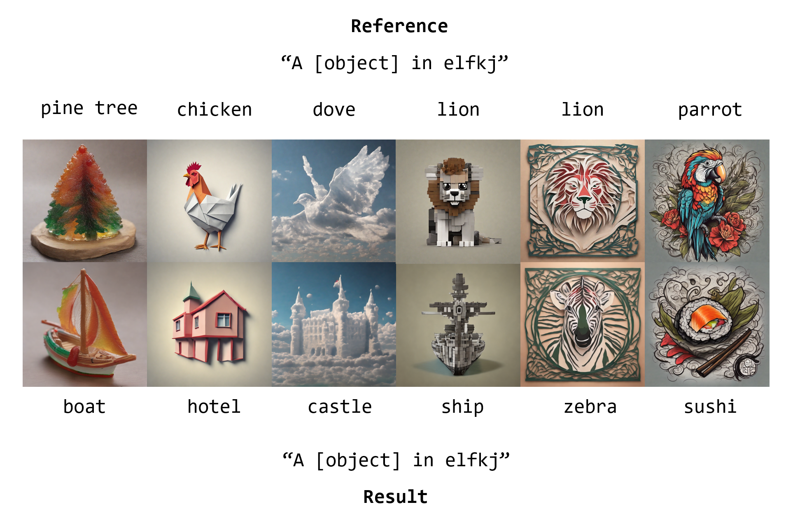

# 计图风格迁移挑战赛



## 简介
本项目包含了第四届计图挑战赛赛道二风格迁移比赛的代码实现。在基础DreamBooth方法上实现了诸多优化，从而能够获得较高质量的风格迁移效果。

## 环境配置

**硬件要求** 本项目的训练和推理可在 1 张 A800 显卡上完成。

**运行环境**
- linux
- python == 3.9
- jittor == 1.3.10

**依赖安装** 参考 [baseline](https://github.com/JittorRepos/JDiffusion/tree/master/examples/dreambooth) 完成基本的环境配置。本项目的`requirements.txt`和`environment.yaml`已经列在根目录下。


## 项目代码
目录结构如下
```
|-- created_prior
|-- configs
|-- data
|-- weights
|-- diffusers
|-- environment.yaml
|-- requirements.txt
|-- run_one.py
|-- test.py
|-- train.py
|-- train.sh
|-- train_all.py
|-- create_prior.py
|-- utils.py
`-- readme.md
```

`created_prior`为无风格图像，由`create_prior.py`脚本生成，以节省训练阶段的时间开销。

`configs`应存放训练和推理的配置文件。在这里我们给出推理的配置。

`diffusers`文件夹存放有修改后的[diffusers_jittor](https://github.com/JittorRepos/diffusers_jittor)的内容。请以该文件夹替换掉原文件，以确保推理过程顺利进行。

`data`文件夹是我们战队在原始的数据集上对caption稍作调整后得到的。

`weights`存放有28个风格的模型权重，每个风格有1~3个模型不等。

`data`和`weights`可以在[这里](https://cloud.tsinghua.edu.cn/d/b2d5bfd228b94185935d/)下载

## 推理
在确保`data`、`weights`、`configs\infer_config.jsonl`就绪的前提下，使用如下指令一键完成所有28个风格的推理：
```bash
python ./test.py
```
生成结果在`result`文件夹中。所有推理阶段的种子都固定为0，只要按照configs中的设置进行推理，其结果就与我们在B榜的最好提交保持一致。

## 训练
在确保`data`文件放置在正确的位置以后，可以通过如下指令来生成无风格图像：
```bash
python ./create_prior.py
```
生成结果被保存在`created_prior`文件夹中。

确保`data`、`created_prior`以及`configs\train_config.jsonl`就绪以后，可通过如下指令训练：
```bash
python ./train_all.py
```
训练所得到的lora权重将被保存在`weights`文件夹中。